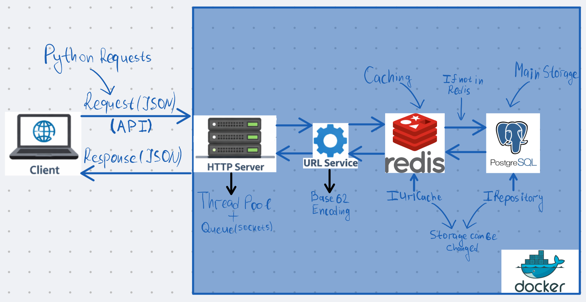

# URL Shortener Service

A high-performance URL shortening service written in C++ using Boost.Asio, PostgreSQL, and Redis.

The project focuses on **clean architecture**, **layer separation**, and **concurrent request handling**.


## Architecture Overview

<p align="center">
  
</p>

## API

### 1. Create short URL

**POST** `/shorten`

#### Request
```json
{
  "url": "https://example.com",
  "username": "john"
}
````

#### Response

```json
{
  "short_url": "http://localhost:8080/abc123"
}
```

---

### 2. Redirect

**GET** `/{short_key}`

Example:

```
GET /abc123
```

➡️ Response: `302 Redirect` to the original URL

---

### 3. Health Check

**GET** `/health`

Response:

```
OK
```

---

## Run Backend with Docker

```bash
docker compose up --build
```

Service will be available at:

```
http://localhost:8080
```

---


## Run Frontend in venv

```bash
cd frontend/
python3 -m venv venv
source venv/bin/activate
pip install -r requirements.txt
python3 app.py
```
